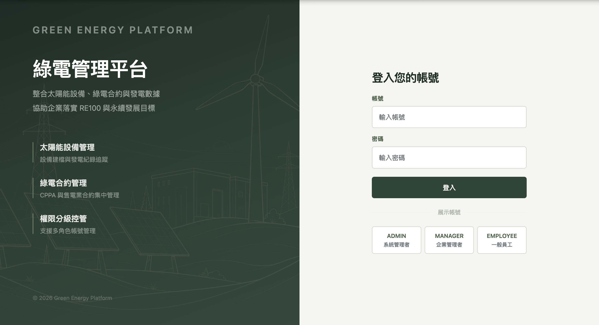
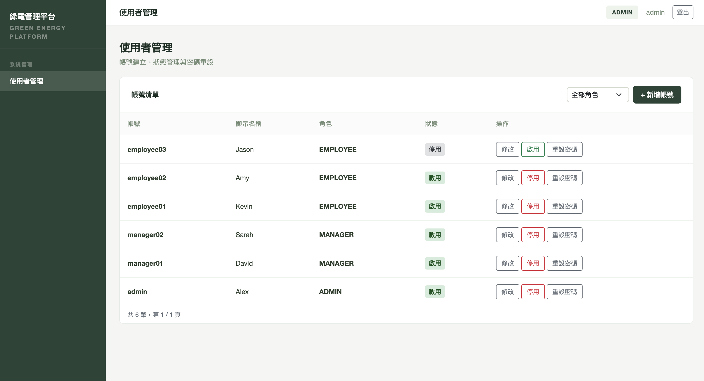
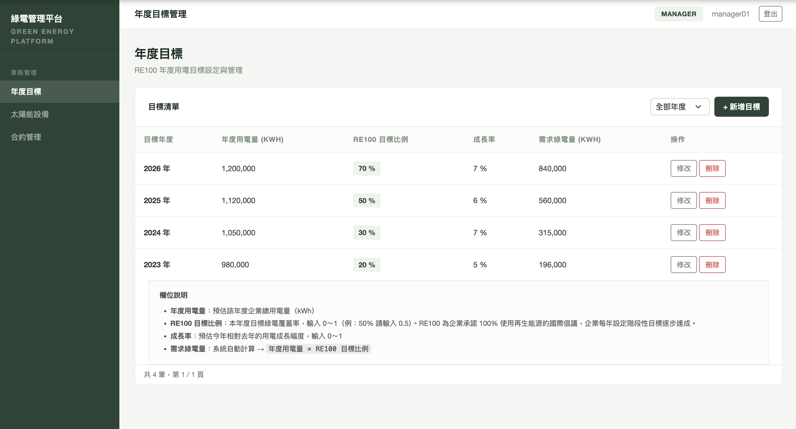
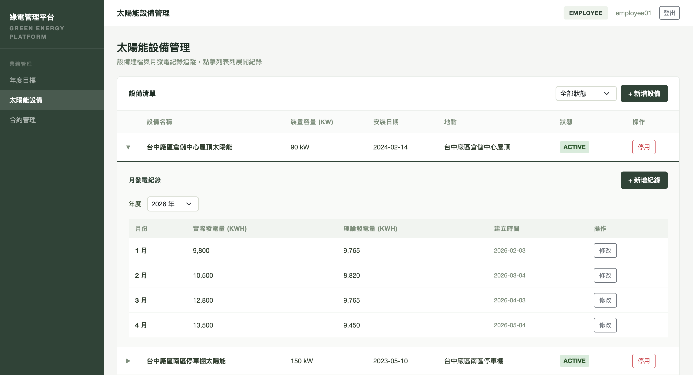
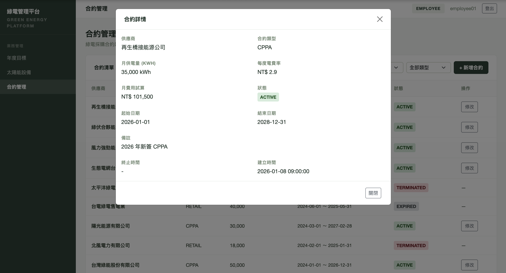

# Green Energy Platform Frontend
>綠電管理平台之前端展示介面

提供使用者管理、年度目標管理、太陽能設備管理及合約管理的操作介面，搭配後端 RESTful API 與 JWT 驗證機制運作。

## 系統畫面
### 登入頁面

提供 JWT 驗證登入功能，並內建 ADMIN、MANAGER、EMPLOYEE 三種角色的快速登入按鈕，方便展示不同角色之權限與功能差異。



### 使用者管理

提供使用者帳號管理功能，包含帳號建立、角色設定、帳號狀態維護等操作。僅限 ADMIN 存取，用於展示 RBAC 角色權限控管機制。



### 年度目標管理

提供年度綠電目標維護與查詢功能，支援 RE100 目標比例管理。MANAGER 可新增、修改與刪除目標資料，EMPLOYEE 僅具備檢視權限。



### 太陽能設備管理

提供太陽能設備資訊管理功能，包含設備基本資料、裝置容量與發電紀錄維護。MANAGER 可查詢設備與發電紀錄，EMPLOYEE 可新增設備、修改設備狀態及登錄月發電紀錄。




### 合約管理

提供綠電採購與售電合約管理功能，支援合約建立、查詢與終止，協助企業追蹤綠電採購與能源管理資訊。EMPLOYEE 負責建立與修改合約，MANAGER 負責查詢與終止合約。



## 線上展示

 [Demo 網站](https://yenkemiel.github.io/gep-frontend/login.html)

> 展示帳號（登入頁提供快速登入按鈕）
> | 角色 | 帳號 | 密碼 |
> |---|---|---|
> | ADMIN | admin | admin123 |
> | MANAGER | manager01 | newpassword123 |
> | EMPLOYEE | employee01 | Employee@123 |

## 後端 Repository

[green-energy-platform](https://github.com/yenkemiel/green-energy-platform/tree/demo) 
完整系統架構、API 設計、權限模型請見後端 README。

## 技術棧

- HTML5
- Bootstrap 5
- 原生 JavaScript（Fetch API）
- GitHub Pages（靜態網站托管）


採用 HTML、Bootstrap 與原生 JavaScript 建置輕量化前端介面，透過 localStorage 管理 JWT Token 與角色資訊，並依使用者角色動態控制功能存取。

## 頁面清單

| 頁面 | 說明 | 可存取角色 |
|---|---|---|
| `login.html` | 登入頁 | 公開 |
| `users.html` | 使用者管理 | ADMIN（全部操作） |
| `targets.html` | 年度目標管理 | MANAGER（新增／修改／刪除）、EMPLOYEE（查詢） |
| `solar-devices.html` | 太陽能設備管理 | MANAGER（查詢）、EMPLOYEE（新增設備／修改狀態／登錄發電紀錄） |
| `contracts.html` | 合約管理 | MANAGER（查詢／終止）、EMPLOYEE（建立／修改） |

## 執行方式

如需本機執行以下指令即可：

```bash
git clone https://github.com/yenkemiel/gep-frontend.git
cd gep-frontend
open login.html
```

> 後端 API 位址設定於各頁面 JS 中的 `API_BASE_URL` 常數，預設指向 Railway 部署的正式環境。